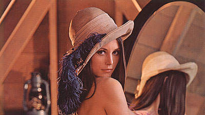

This shows how to create a CYOA using HTML and CSS.

Advantages:
- Layout is done automatically.
- Images are cropped automatically.
- Editing/rearranging/restyling is trivial.

###HOW-TO:

Download the files to your computer and edit cyoa.html. Everything can be done
using copy-paste. To add a new choice, copy-paste this inside "choices-container" tags:

    

        
        

            choice 1
        

        

            Hello friends! This is choice 1.
        

    

- lena.jpg = Image file (can be URL or path to your computer).
- third-size = Width of choice box. style.css contains a list of possibilities.

###Saving to image

Once your CYOA is complete you can save it as an image using a browser extension.

- **Chrome:** https://chrome.google.com/webstore/detail/full-page-screen-capture/fdpohaocaechififmbbbbbknoalclacl?hl=en-US
- **Firefox:** https://addons.mozilla.org/en-US/firefox/addon/fireshot/
